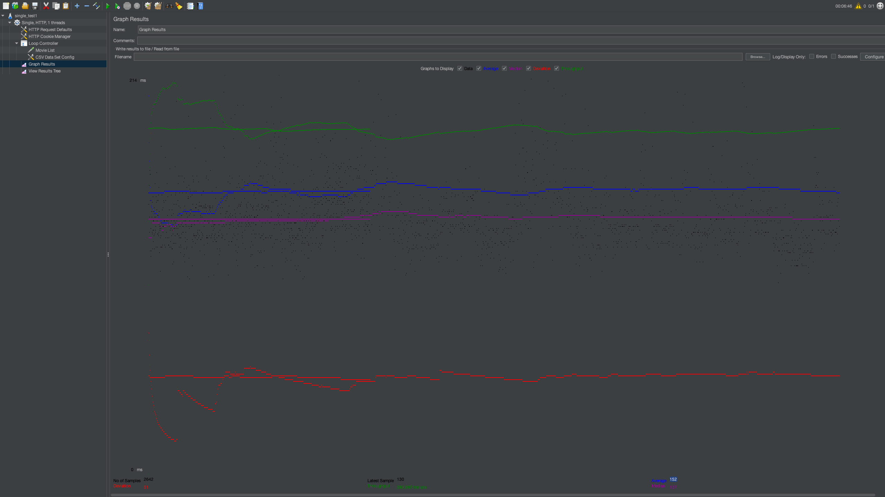
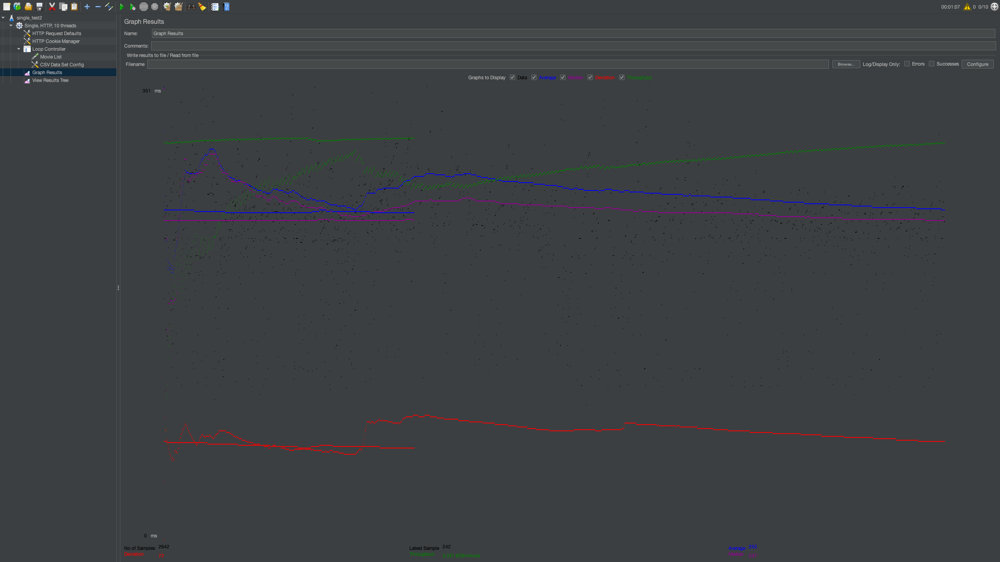
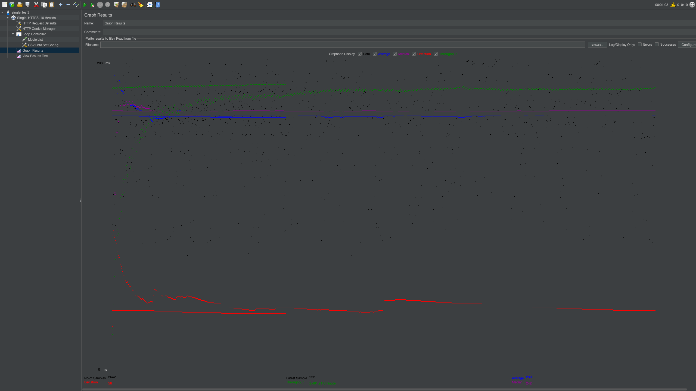
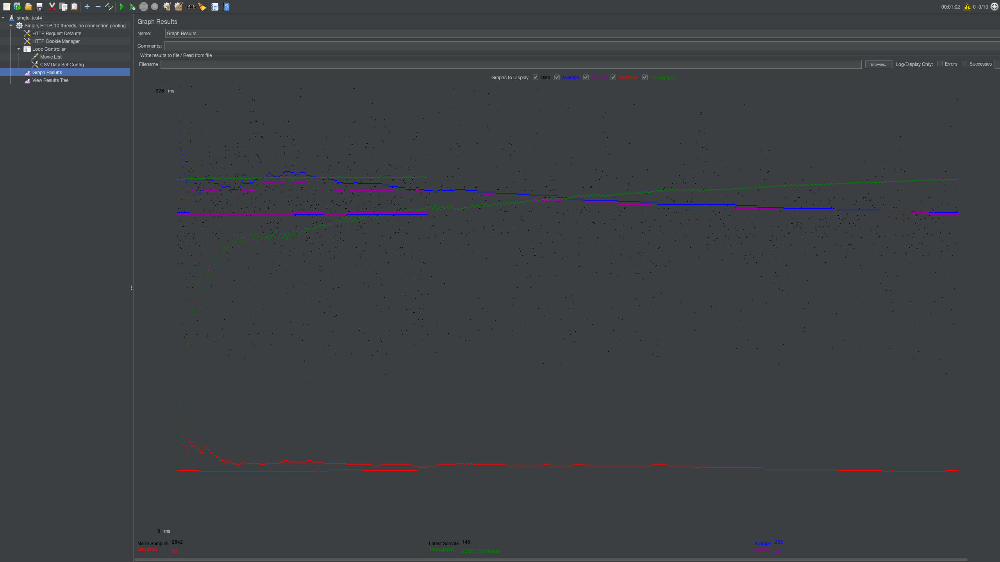
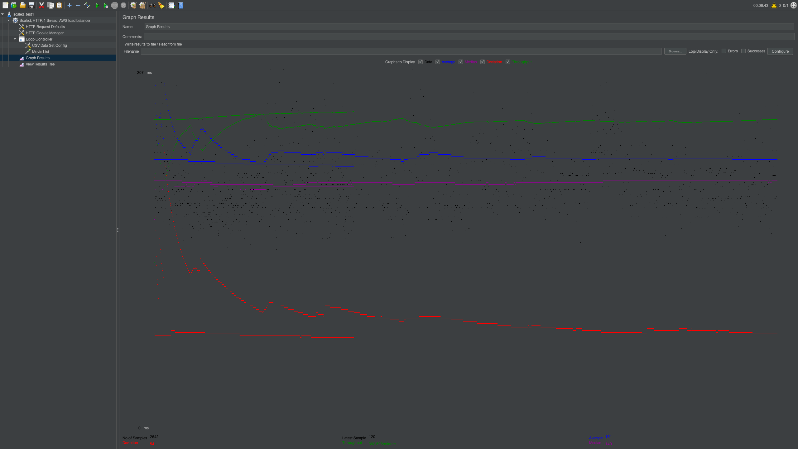
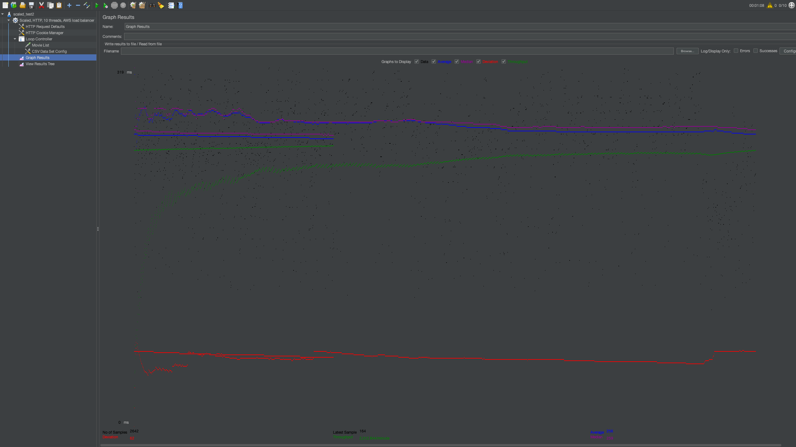
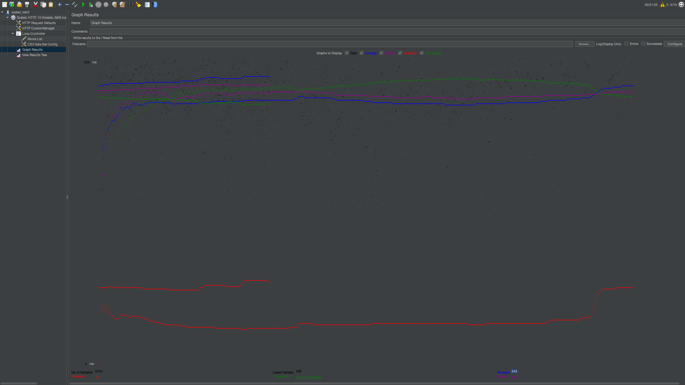

# Fabflix-Webapp

### Members: Angeline Pho (@angelinepho) & Chun Hong (Roy) Chan (@roychan1)

### source code:
- src/main/java/
- src/main/webapp/

### Images:
- img/

### Logs:
- logs/

### Log processing scripts:
- scripts/

### Test plans:
- tests/

### sql script:
- sql/createtable.sql
- sql/addPriceColumn.sql
- sql/createtable.sql
- sql/modifySales.sql
- sql/stored-procedure.sql

### Password Encrypt java files:
- encryptPasswords/

### SAX XML Parser files:
- saxparser/

### Android app files:
- android/

## 1. Demo Video URL:
- Project 1: https://www.youtube.com/watch?v=2dUSiSQxQ4E
- Project 2: https://youtu.be/qcDCc_ruLi4
- Project 3: https://youtu.be/Ut7OkenKhPM
- Project 4: https://www.youtube.com/watch?v=guQE3P9Lbys
- Project 5: https://www.youtube.com/watch?v=PMEKwPwXz4M

## 2. How to deploy application with Tomcat:
Inside the repo where the pom.xml file is, run 'mvn package'. > Run 'ls -lah /var/lib/tomcat9/webapps/' to see if the WAR file is already deployed > If it is deployed, remove the previous .WAR file, otherwise, run 'sudo cp ./target/*.war /var/lib/tomcat9/webapps/'

The deployed application will appear here: https://3.145.195.57:8443/demo1-1.0-SNAPSHOT/

## 3. Member contribution:
- Roy:
  - Project 0 and 1: set up aws instance, tomcat & maven, wrote sql script, populated MySQL on aws instance, wrote part of MovieListServlet.java, wrote SingleStarServlet.java, did styling for single-star page
  - Project 2: implemented the main page (with search and browse) (task 2), implemented the shopping cart (task 4)
  - Project 3: Adding HTTPS (task 3), Use PreparedStatement (task 4), Importing large XML data files into the Fabflix database (task 7)
  - Project 4: Developing an Android app for Fabflix (task 2)
  - Project 5: MySQL Master-Slave Replication (task 2), Scaling Fabflix with a cluster of MySQL/Tomcat and a load balancer (task 3)
- Angeline:
  - Project 0 and 1: set up git repo, wrote part of MovieListServlet.java, wrote SingleMovieListServlet.java, did styling for movie-list page (home), did styling for single-movie page
  - Project 2: implemented the login page (task 1), implemented the extension of move list page, single pages & jump functionality (task 3)
  - Project 3: Adding reCAPTCHA (task 2), Use encrypted password (task 5), Implementing a Dashboard using Stored Procedure (task 6)
  - Project 4: Improving the Fabflix by full-text Search and Autocomplete (task 1)
  - Project 5: JDBC Connection Pooling (task 1), Measuring the performance of Fabflix search feature (task 4)

## 4. How the LIKE predicate was used:
- The LIKE predicate was only used in the file 'src/main/java/MovieListServlet.java'
  - was used to find all strings containing a pattern (i.e. '%abc%') for the columns Title, Director, Star, Genre
  - was used to find all strings starting with a pattern (i.e. 'abc%') for the alphabetical browse feature

## 5. Files with queries using PreparedStatement
The following files used PreparedStatements:
- https://github.com/uci-jherold2-teaching/cs122b-fall-team-2/blob/main/src/main/java/ConfirmationServlet.java
- https://github.com/uci-jherold2-teaching/cs122b-fall-team-2/blob/main/src/main/java/DashboardLoginServlet.java
- https://github.com/uci-jherold2-teaching/cs122b-fall-team-2/blob/main/src/main/java/DashboardServlet.java
- https://github.com/uci-jherold2-teaching/cs122b-fall-team-2/blob/main/src/main/java/IndexServlet.java
- https://github.com/uci-jherold2-teaching/cs122b-fall-team-2/blob/main/src/main/java/LoginServlet.java
- https://github.com/uci-jherold2-teaching/cs122b-fall-team-2/blob/main/src/main/java/MovieListServlet.java
- https://github.com/uci-jherold2-teaching/cs122b-fall-team-2/blob/main/src/main/java/PaymentServlet.java
- https://github.com/uci-jherold2-teaching/cs122b-fall-team-2/blob/main/src/main/java/ShoppingCartServlet.java
- https://github.com/uci-jherold2-teaching/cs122b-fall-team-2/blob/main/src/main/java/SingleMovieListServlet.java
- https://github.com/uci-jherold2-teaching/cs122b-fall-team-2/blob/main/src/main/java/SingleStarServlet.java

## 6. Optimization Strategies
- Applied a Full-Text Index to the "name" field of "stars" table:
  - Example command (in FabflixSAXParser.java): "INSERT IGNORE INTO stars SELECT ? , ? , ? WHERE NOT EXISTS (SELECT * FROM stars WHERE MATCH (name) AGAINST ( ? IN BOOLEAN MODE) AND name= ?)"
  - Inserting movies and stars without an index took 4612.5007683 seconds on one try
  - Inserting the same things with an index took 29.4568725 seconds on one try

- Reduced number of calls to MySQL:
  - Example commands BEFORE optimization (in FabflixSAXParser.java):
    - "SELECT id FROM stars WHERE MATCH (name) AGAINST ( ? IN BOOLEAN MODE) AND name= ? "
    - "INSERT IGNORE INTO stars_in_movies VALUES( ? , ? )"
  - Example commands AFTER optimization (in FabflixSAXParser.java):
    - "INSERT IGNORE INTO stars_in_movies SELECT id , ? FROM stars WHERE MATCH (name) AGAINST ( ? IN BOOLEAN MODE) AND name= ?"
  - Inserting movies, stars, stars_in_movies using 2 statements for this purpose took 213.9138421 seconds on one try
  - Inserting the same things using 1 combined statement took 112.4215092 seconds on one try

## 7. Inconsistency Report
mains243.xml:

Line '2585': 'year' element not found (or in non-integer format).
Line '2887': 'fid' element not found.
Line '2893': 'fid' element not found.
Line '2894': 'fid' element not found.
Line '2895': 'fid' element not found.
Line '2897': 'fid' element not found.
Line '2898': 'fid' element not found.
Line '2899': 'fid' element not found.
Line '2900': 'fid' element not found.
Line '2901': 'fid' element not found.
Line '2902': 'fid' element not found.
Line '2903': 'fid' element not found.
Line '2904': 'fid' element not found.
Line '2905': 'fid' element not found.
Line '2906': 'fid' element not found.
Line '2907': 'fid' element not found.
Line '2908': 'fid' element not found.
Line '5497': 'year' element not found (or in non-integer format).
Line '6578': 'year' element not found (or in non-integer format).
Line '6585': 'year' element not found (or in non-integer format).
Line '8542': 'year' element not found (or in non-integer format).
Line '8724': 'cats' element not found.
Line '9056': 'year' element not found (or in non-integer format).
Line '9688': 'year' element not found (or in non-integer format).
Line '9711': 'year' element not found (or in non-integer format).
Line '10689': 'year' element not found (or in non-integer format).
Line '10836': 'year' element not found (or in non-integer format).
Line '12102': 'year' element not found (or in non-integer format).
Line '13715': 'year' element not found (or in non-integer format).
Line '14220': 'cats' element not found.
Line '14489': 'year' element not found (or in non-integer format).
Line '14525': 'year' element not found (or in non-integer format).
Line '14560': 'year' element not found (or in non-integer format).
Line '14651': 'year' element not found (or in non-integer format).
Line '15057': 'year' element not found (or in non-integer format).
Line '15270': 'dirname' element not found.
Line '15271': 'dirname' element not found.
Line '15418': 'dirname' element not found.
Line '15422': 'dirname' element not found.
Line '15425': 'dirname' element not found.
No of movies '12115'.

casts124.xml:

No of casts '48938'.

actors63.xml:

Line '927': 'dob' element not found.
No of stars '6838'.

## 8. Connection Pooling
#### Filename/path of all code/configuration files in GitHub of using JDBC Connection Pooling.
- https://github.com/uci-jherold2-teaching/cs122b-fall-team-2/blob/main/src/main/java/ConfirmationServlet.java
- https://github.com/uci-jherold2-teaching/cs122b-fall-team-2/blob/main/src/main/java/DashboardLoginServlet.java
- https://github.com/uci-jherold2-teaching/cs122b-fall-team-2/blob/main/src/main/java/DashboardServlet.java
- https://github.com/uci-jherold2-teaching/cs122b-fall-team-2/blob/main/src/main/java/IndexServlet.java
- https://github.com/uci-jherold2-teaching/cs122b-fall-team-2/blob/main/src/main/java/LoginServlet.java
- https://github.com/uci-jherold2-teaching/cs122b-fall-team-2/blob/main/src/main/java/MovieListServlet.java
- https://github.com/uci-jherold2-teaching/cs122b-fall-team-2/blob/main/src/main/java/MovieSuggestion.java
- https://github.com/uci-jherold2-teaching/cs122b-fall-team-2/blob/main/src/main/java/PaymentServlet.java
- https://github.com/uci-jherold2-teaching/cs122b-fall-team-2/blob/main/src/main/java/ShoppingCartServlet.java
- https://github.com/uci-jherold2-teaching/cs122b-fall-team-2/blob/main/src/main/java/SingleMovieListServlet.java
- https://github.com/uci-jherold2-teaching/cs122b-fall-team-2/blob/main/src/main/java/SingleStarServlet.java
#### We used Connection Pooling on every Fabflix Java Servlet that reads and/or writes to the database.

#### To use Connection Pooling with two backend SQL, you need to set 'cachePrepStmts' to true in order to cache the prepared statements. Prepared statements are specific to each connection.

## 9. Master/Slave
  - #### Include the filename/path of all code/configuration files in GitHub of routing queries to Master/Slave SQL.
    - src/main/webapp/WEB-INF/web.xml
    - src/main/webapp/META-INF/context.xml

  - #### How read/write requests were routed to Master/Slave SQL?
    - Two MySQL dataSources are introduced in web.xml and defined in context.xml. Configurations for connection pooling are included when necessary.
    - One dataSource is for reading while the other is for writing. The dataSource url in context.xml contains the "cachePrepStmts=true" argument for PreparedStatements to work with connection pooling. The url ip is always "localhost" for the read dataSource. The url ip for the write dataSource, on the other hand, is the private ip of the master instance for the slave deployment and "localhost" for the master deployment.
    - With sticky session in place, whichever (master/ slave) instance that gets connected to will have all of its read requests performed on its local MySQL database. As for write requests, the master instance will write to its own local MySQL database and the slave instance will write to the master's MySQL database.
    - The MySQL user referenced by the write dataSource on the slave instance is a master instance MySQL user, with "%" as host name and is granted all rights. This allows for writing to a remote MySQL database.
    - The AWS security groups for the master and slave instances have an inbound rule for port 3306 (MySQL/ Aurora) that is opened to each other's private ip.
    - Master/ slave replication must be set up before the configurations above are performed.

## 10. JMeter TS/TJ Time Logs
  - Run log_processing.py script to print average query time and average search servlet time.
  - ts_log.log and tj_log.log stored in /var/lib/tomcat9/webapps/demo1-1.0-SNAPSHOT/ on aws instance.
  - Run clear_log_processing.py script to remove logs.

## 11. JMeter TS/TJ Time Measurement Report

| **Single-instance Version Test Plan**          | **Graph Results Screenshot** | **Average Query Time(ms)** | **Average Search Servlet Time(ms)** | **Average JDBC Time(ms)** | **Analysis**                                                                                                                                                                                     |
|------------------------------------------------|------------------------------|----------------------------|-------------------------------------|----------------------|--------------------------------------------------------------------------------------------------------------------------------------------------------------------------------------------------|
| Case 1: HTTP/1 thread                          |    | 152                        | 17.09577997615443        | 17.038177448902346                    | Fastest average query time because there was only one thread, but less threads means less queries/requests. This test took over 6 mins to process the entire query file.                         |
| Case 2: HTTP/10 threads                        |    | 253                        | 88.47440763966692                   | 88.34251545685088                     | Slower average query time than Case 1 because there are more threads running so it took around 1 min to process the entire query file.                                                           |
| Case 3: HTTPS/10 threads                       |    | 239                        | 77.91799055374716                   | 77.8869281332324                   | With HTTPS enabled, average query time was slightly faster than Case 2. The total time to process the entire query file was around 1 min as well.                                                |
| Case 4: HTTP/10 threads/No connection pooling  |    | 233                        | 60.72115984367903                                  | 60.51463583724451                  | With no connection pooling, average query time was again slightly faster than the previous. It also took around 1 min to process the query file. |

| **Scaled Version Test Plan**                   | **Graph Results Screenshot**       | **Average Query Time(ms)** | **Average Search Servlet Time(ms)** | **Average JDBC Time(ms)** | **Analysis**                                                                                                                                                                                                          |
|------------------------------------------------|------------------------------------|----------------------------|-------------------------------------|-------------------------|-----------------------------------------------------------------------------------------------------------------------------------------------------------------------------------------------------------------------|
| Case 1: HTTP/1 thread                          |  | 151                        | 17.315330124526874                                  | 17.235889239212717                        | This case was similar to the Single-Instance Case 1 with the fastest average query time. It was faster because there was only one thread, but less threads means it took over 6 mins to process the entire query file. |
| Case 2: HTTP/10 threads                        |  | 256                        | 81.22871698902347                                  | 81.05841958137775                      | Similar to Single-Instance Case 2 with the slowest average query time. However, because there are more threads running it took around 1 min to process the entire query file.                                         |
| Case 3: HTTP/10 threads/No connection pooling  |  | 243                         | 65.87633818168055                                  | 65.82953771006812                      | This shows more dramatically the difference between Connection Pooling vs. No Connection Pooling. No Connection Pooling is faster on our configuration.                                                         |
